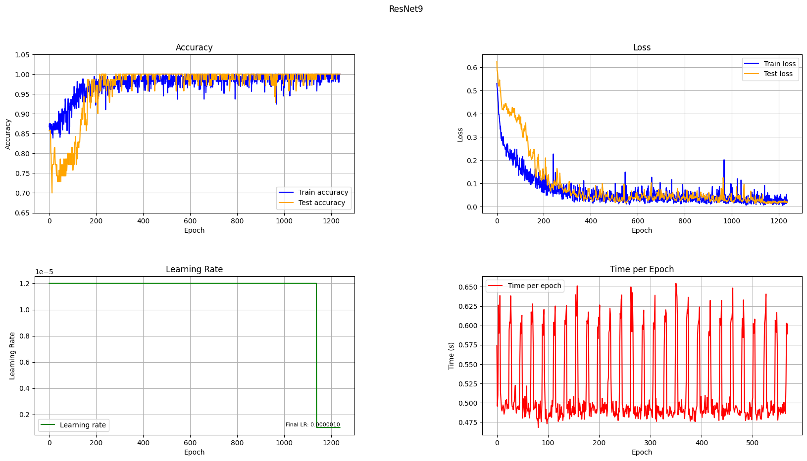
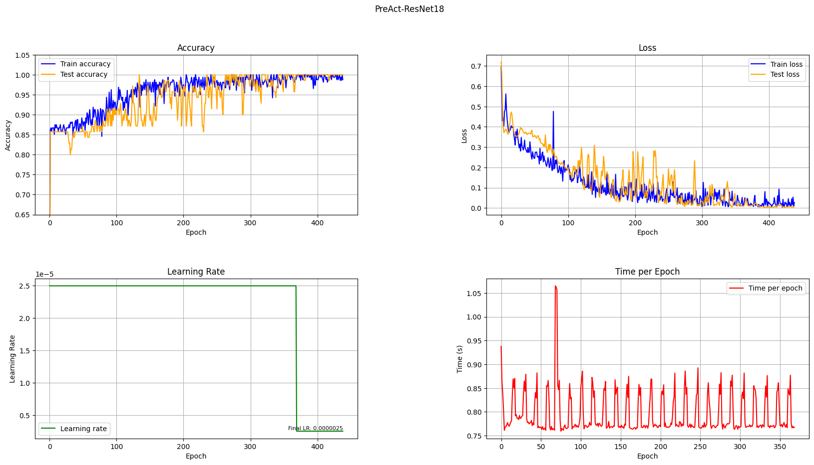

# SUR project

This repository contains the code for the [SUR](https://www.fit.vut.cz/study/course/SUR/.en) project.

### Classification problem

In this project we had to create a 2 classifiers for custom dataset with very few examples without using outside data.
Data contains 2 classes: `target` and `non-target`. We had to create a classifier that would be able to classify the data into these 2 classes.
Image data has 3 channels and is in RGB format. Their size is 80x80 pixels. All images are closeups of faces.

**Dataset**:
- train: 151 examples
    - target: 20
    - non-target: 131
- test: 70 examples
    - target: 10
    - non-target: 60

**Models**:
1. ResNet9 - 9 layer ResNet model - `6 571 266 params`
2. PreActResNet18 - 18 layer PreActResNet model -  `11 167 042 params`
3. PreActResNet34 - 34 layer PreActResNet model - `21 275 202 params` 
3. ConvMixer - ConvMixer model (substantially worse than the other 2 models)

They key was to use heavy data augmentation to increase the number of examples in the dataset.
Here are the augmentations used:
```python
TRANSFORM_TRAIN: transforms.Compose = transforms.Compose([
                        transforms.RandomCrop(80, padding=8, padding_mode='constant'),
                        transforms.GaussianBlur(3, sigma=(0.01, 1)),
                        transforms.RandomRotation(degrees=(0, 8)),
                        transforms.RandomGrayscale(),
                        transforms.RandomAutocontrast(),
                        transforms.RandomAdjustSharpness(sharpness_factor=2),
                        transforms.RandomPosterize(4),
                        transforms.RandomEqualize(),
                        transforms.Lambda(lambda x: cutout(x, 17, 17)),
                        transforms.RandomHorizontalFlip(),
                        transforms.ToTensor(),
])
```

All the hyperparameter configurations can be found in `src/config.py`.
Code for models are stores in `src/models/` and the training code is in `src/trainmodel.py`.

### Results

**Best models from checkpoints**:
```bash
[ResNet9]           - Test Loss: 0.01912, Test Acc: 1.0000, Train Loss: 0.00067, Train Acc: 1.0000
[Preact ResNet18]   - Test Loss: 0.00766, Test Acc: 1.0000, Train Loss: 0.00012, Train Acc: 1.0000
[Preact ResNet18 A] - Test Loss: 0.00539, Test Acc: 1.0000, Train Loss: 0.00006, Train Acc: 1.0000
[Preact ResNet34 A] - Test Loss: 0.00009, Test Acc: 1.0000, Train Loss: 0.00002, Train Acc: 1.0000
```




### How to run
The main code is in jupyter notebook `image_cnn.ipynb`. The code is written in Python 3.11.7.


## Authors
- **Jan Holáň**
- **Matej Horník**